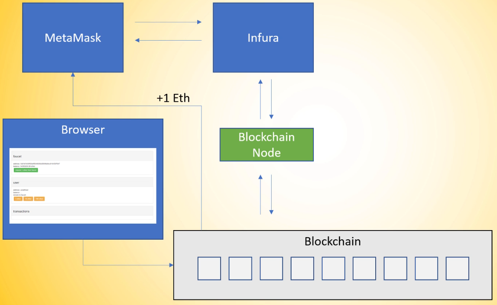

- [Transactions, Wallets And Hashing Step By Step](#transactions-wallets-and-hashing-step-by-step)
  - [Metamask, Infura, Blockchain Nodes \& The Ledger](#metamask-infura-blockchain-nodes--the-ledger)
  - [Ethereum Transactions And Signatures, Private/Public Keys](#ethereum-transactions-and-signatures-privatepublic-keys)
    - [Accounts \& Signing](#accounts--signing)
  - [Cryptographic Hashing](#cryptographic-hashing)
    - [Hashing of Hashes](#hashing-of-hashes)

# Transactions, Wallets And Hashing Step By Step

## Metamask, Infura, Blockchain Nodes & The Ledger

- Metamask connects to Infura in the background
- Infura is a blockchain infrastructure provider
- They internally have blockchain nodes running in their background
- They are hosting parity and Go Ethereum nodes
- And opening a RESTful API for Metamask to interact with the blockchain through a blockchain node that they are hosting
- I hit to get the faucet & they are interact with blockchain & blockchain gives me `1 eth`

- I can see my transaction in the EtherScan
- It also interact with blockchain nodes & show the data

## Ethereum Transactions And Signatures, Private/Public Keys

- `sendTransaction`

- `from`, `to` & `value` in the EtherScan

- Why do the transaction is not malicious?
- As I signed that transaction

- Example of signTransaction

- Using `v`, `r` & `s`, those three parameters I can authenticate that transactin is not from a malicious actor

### Accounts & Signing

- Step-01
  - I need a transaction object
- Step-02
  - Need a metamask wallet where I have private key
  - Private key is a 32-bytes long
  - It is a randomized 64 hex characters long string
- Step-03
  - From private key, I can generate public key using ECDSA
  - ECDSA is a method named Elliptic Curve Digital Signature Algorithm
  - It's a one directional process
  - So, I can't get back private key from that public key
- Step-04
  - From public key, I can generate Ethereum Account
  - Using keccak hash of the last 20 bytes of the public key
- Step0-05
  - A transaction is signatured by using transaction & private key
- Step-06
  - Using `r` & `s`, I can run it through ECRecover function
  - Get the output of public key & ethereum account

- So,
  - Transaction signatures ensure authenticity of transactions
  - Signatures are generated from private keys
  - Public keys & addresses are generated from private keys
  - Private keys have to be kept save under all circumstances

## Cryptographic Hashing

- I can generate hash from anything using hash function
- A simple change makes a big change in hash

- Five main properties:
  - It's deterministic so the same message always results in the same hash
  - It's quick to compute
  - It's a one directional process
  - A simple change makes a big change in hash
  - It's impossible to find two different messages with the same hash value

### Hashing of Hashes

- Hashing of hashes work like that

- If I change anything in the hash then the whole output will be changed automatically

- Blockchain hashing

- Blockchain hashing & decentralization

