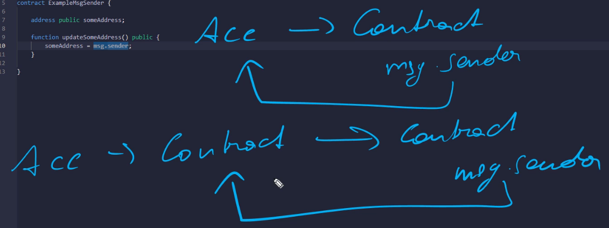
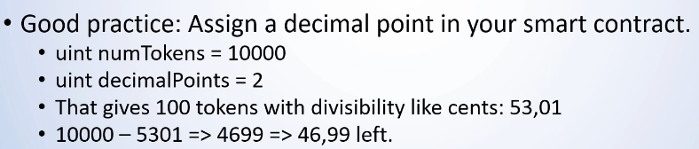

- [Solidity](#solidity)
  - [Blockchain Basics](#blockchain-basics)
  - [Programming](#programming)
    - [Boolean](#boolean)
    - [Signed/Unsigned Integer](#signedunsigned-integer)
    - [Integer Rollover - SafeMath](#integer-rollover---safemath)
    - [Strings \& Bytes](#strings--bytes)
    - [Address Types](#address-types)
    - [`Msg.Sender` Object](#msgsender-object)
    - [Writing And Reading Functions - View Vs Pure](#writing-and-reading-functions---view-vs-pure)
    - [Constructor](#constructor)
    - [Summary](#summary)

# Solidity

## Blockchain Basics

- Smart contract is a piece of code that running in the blockchain
- Blockchain is a state machine that needs a transaction to change its state
- The state changes through mining & transactions
- Solidity is complied in the EVM bytecode
- In the Ethereum network, every Ethereum node executes the same code as every node has a copy of the chain
- What will happen?
  1. I write solidity smart contract
  2. Code complied by EVM bytecode
  3. Then I send the transaction with that bytecode to the blockchain network
  4. The network will send that code to the every node
  5. Every node in the network will execute the same code as every node has a copy of the whole chain
- `SPDX-License-Identifier: MIT` identifies the license of that file or source code
- `pragma solidity 0.8.14` is a pre-compiler line that tells the pre-compiler to select the rights solidity compiler
- But `pragma solidity ^0.8.14` means `0.8.14` or larger but not more than `0.9`
- Convention: Contract name should be CapWords style
- Every time I click deploy, it will deploy a new instance

## Programming

### Boolean

- Default value is `false`

```js
// SPDX-License-Identifier: MIT

pragma solidity 0.8.14;

contract ExampleBoolean {
  // Solidity creates a getter method automatically
  bool public myBool; // Define a boolean

  // setter method
  function setMyBool(bool _myBool) public {
    myBool = _myBool;
  }
}
```

### Signed/Unsigned Integer

- Default value is `0`
- If I initialize variable with `0` or default value then extra gas is needed

```js
// SPDX-License-Identifier: MIT

pragma solidity 0.8.14;

contract ExampleUint {
  uint256 public myUint; // 0 - (2^256)-1
  uint8 public myUint8 = 250;

  // Exponentiation is done with **
  uint8 public myUint8_EXP = 2**4; // 16

  int public myInt = -10; // -2^255 to 2^255 - 1
}
```

### Integer Rollover - SafeMath

- `uint8` ranges from `0` to `255`
- If I increment `255` it will automatically be `0`
- If I decrement `0`, it will become `255` if both increment/decrement the operation is unchecked
- No warnings, no errors
- For example, this can become problematic, if I store a token-balance in a variable and decrement it without checking.

```js
// SPDX-License-Identifier: MIT

// Version: 0.7.0
pragma solidity 0.7.0;

contract ExampleWrapAround {
  uint8 public myUint8 = 250;

  function decrement() public {
    myUint8--;
  }

  function increment() public {
    myUint8++;
  }
}
```

- If I deploy this and run `increment` more than 5 times, the `myUint8` will just magically start from `0` again. No warning.
- But I can still enforce this behavior with an `unchecked` block.

```js
// SPDX-License-Identifier: MIT

// Version: 0.8.15
pragma solidity 0.8.15;

contract ExampleWrapAround {
  uint256 public myUint;

  function decrementUintUnchecked() public {
    // Rollover the behavior
    unchecked {
      myUint--;
    }
  }

  function decrementUint() public {
    myUint--;
  }
}
```

- Now, if I run `decrementUintUnchecked` it will go from `0` to the `2^256 - 1`.

### Strings & Bytes

- Strings are actually Arrays, very similar to a bytes-array
- Strings are expensive to store and work with in Solidity (Gas costs)
- So, use Events instead

```js
// SPDX-License-Identifier: MIT

pragma solidity 0.8.15;

contract ExampleStrings {
  string public myString = "Hello World";

  function setMyString(string memory _myString) public {
    myString = _myString;
  }
}
```

- There are no native string comparison functions in Solidity.
- There is still a way to compare two strings: by comparing their `keccak256` hashes.

```js
// SPDX-License-Identifier: MIT

pragma solidity 0.8.15;

contract ExampleStrings {
  string public myString = "Hello World";

  function setMyString(string memory _myString) public {
    myString = _myString;
  }

  function compareTwoStrings(string memory _myString) public view returns(bool) {
    return keccak256(abi.encodePacked(myString)) == keccak256(abi.encodePacked(_myString));
  }
}
```

- As strings are represented in UTF8 & bytes are not
- So, strings are not advisable to use in the smart contracts
- Strings do not have a length property, bytes do have that
- [More Info](https://ethereum-blockchain-developer.com/2022-02-solidity-basics-blockchain-messenger/04-strings-bytes/)

### Address Types

- Ethereum supports transfer of Ether and communication between Smart Contracts.
- Addresses can be stored in Smart Contracts and can be used to transfer Ether from the Smart Contract to to an address stored in a variable.
- A variable of the type address holds 20 bytes.
- Address has a member named `balance` in `Wei` form

```js
// SPDX-License-Identifier: MIT

pragma solidity 0.8.15;

contract ExampleAddress {
  address public someAddress;

  function setSomeAddress(address _someAddress) public {
    someAddress = _someAddress;
  }

  function getAddressBalance() public view returns(uint) {
    return someAddress.balance; // in 'wei' form
  }
}
```

- _Important:_
  - The Smart Contract is stored under its own address
  - `someAddress` can store its own address & any other address as well
  - All information on the blochain is public, so I can retrieve the balance of the address stored in the variable `someAddress`
  - The Smart Contract can transfer funds from his own address to another address.
  - But it cannot transfer the funds from another address.
  - Transferring Ether is fundamentally different than transferring ERC20 Tokens or NFTs

### `Msg.Sender` Object

- The msg-object is a special variables which exist in the global namespace
- It is used to provide information about the blockchain or the transaction.
- Properties are `msg.sender` & `msg.value`
- `msg.sender` contains the address of the whoever initiated the current contract call.

```js
// SPDX-License-Identifier: MIT

pragma solidity 0.8.15;

contract ExampleMsgSender {
  address public someAddress;

  function updateSomeAddress() public {
    someAddress = msg.sender;
  }
}
```

- `someAddress` will magically have your address.
- Because in `msg.sender` the address is stored who initiated the contract call.
- As I initiated the contract call, `msg.sender` is stored my address.



### Writing And Reading Functions - View Vs Pure

- Modifying the state costs gas
- It's a concurrent operation that requires mining and doesn't return any values
- Two kinds of reading function
  - **view:**
    - Accessing state/storage variables
    - Access the variables outside of the scope
    - But I can't write them
  - **pure:**
    - Not accessing state/storage variables
    - Access other variables
    - Also access other `pure` functions
- Create a state-modifying writing function

```js
//SPDX-License-Identifier: MIT

pragma solidity 0.8.15;

contract ExampleViewPure {
  uint public myStorageVariable;

  // 'view'
  function getMyStorageVariable() public view returns(uint) {
    return myStorageVariable;
  }

  // 'pure'
  function getAddition(uint a, uint b) public pure returns(uint) {
    return a + b;
  }
}
```

### Constructor

- It is automatically called during Smart Contract deployment
- And it can never be called again after that.

```js
//SPDX-License-Identifier: MIT

pragma solidity 0.8.15;

contract ExampleConstructor {
  address public myAddress;

  // constructor
  constructor(address _someAddress) {
    myAddress = _someAddress;
  }

  function setMyAddress(address _myAddress) public {
    myAddress = _myAddress;
  }

  function setMyAddressToMsgSender() public {
    myAddress = msg.sender;
  }
}
```

### Summary

- All variables are initilized by default
- There are no `null` or `undefined`
- Default values of `uint`, `int` is `0`
- Default values of `bool` is `0`
- Default values of `string` is `0`
- Public variables generate a getter with the name of the variable
- Reference types need a memory location (memory/storage)
- Fixed points are not implemented yet


