- [Smart Money - Deposit \& Withdrawals](#smart-money---deposit--withdrawals)
  - [Transaction Details](#transaction-details)
  - [Behind the Scenes of Metamask](#behind-the-scenes-of-metamask)
    - [Infura](#infura)
  - [MetaMask](#metamask)
  - [An Ethereum Transaction](#an-ethereum-transaction)
  - [Cryptographic Hashing](#cryptographic-hashing)
  - [Cancel or Update Transaction](#cancel-or-update-transaction)
  - [Payable Modifier And `msg.value`](#payable-modifier-and-msgvalue)
  - [Fallback And Receive](#fallback-and-receive)
  - [Section Summary](#section-summary)
  - [The Smart Money Implementation](#the-smart-money-implementation)

# Smart Money - Deposit & Withdrawals

## Transaction Details

- [Visit to see the transaction details](https://sepolia.etherscan.io/tx/0x5daec3d73538cd6cc42f7e683972d8afb6237d7971f74e6b75a10b4e7580ea91)

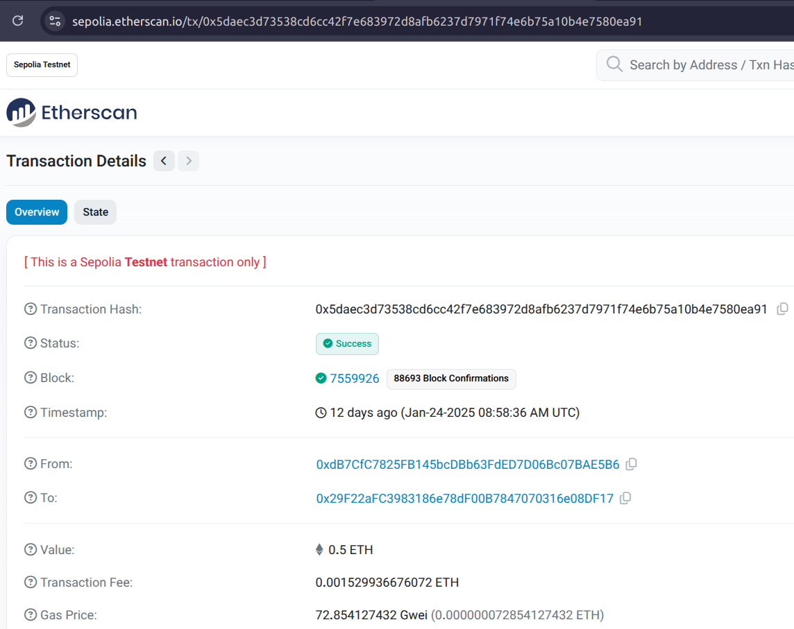

## Behind the Scenes of Metamask

### Infura

- Infura is a global infrastructure provider for decentralized applications (DApps).
- It allows developers to connect to the Ethereum network without running a full node
- Making it easier and faster to build DApps.

## MetaMask

- MetaMask is an easy way for developers to get started building DApps on the Ethereum blockchain.
- With MetaMask, you can
  - create and manage your own wallets,
  - send transactions, and
  - explore contracts.

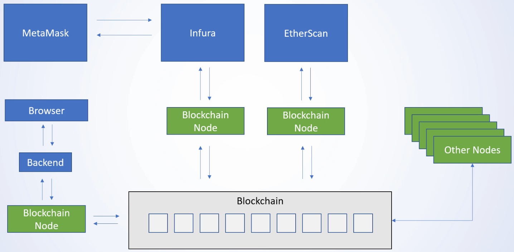

## An Ethereum Transaction

- `gasPrice`
  - Base price of a gas
  - Priority to the miners
  - How fast the block will be mined

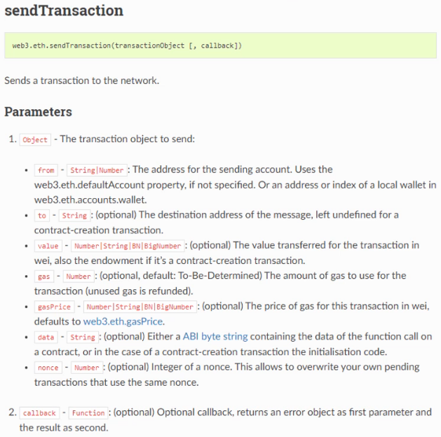

- _Q-1:_ How does the blockchain know that the transaction is not malicious?
- _Q-2:_ How does the Blockchain know it's allowed to transfer [value] from account [from] to account [to]?
- _Answer:_ Create a signature

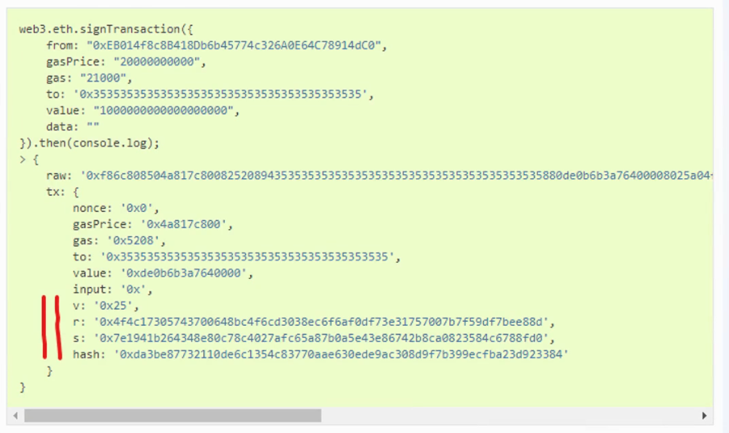

- How that information comes from the blockchain?
- _Step-1:_ I send a transaction object

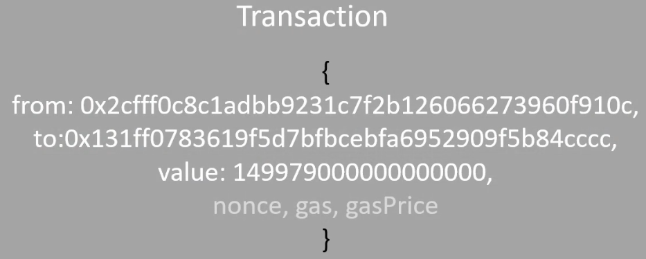

- _Step-2:_ I need a private key stored in the metamask

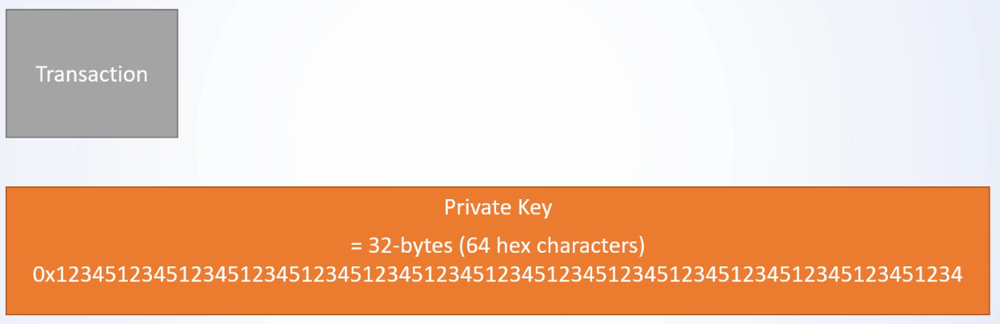

- _Step-3:_ Metamask uses ECDSA to create the public key

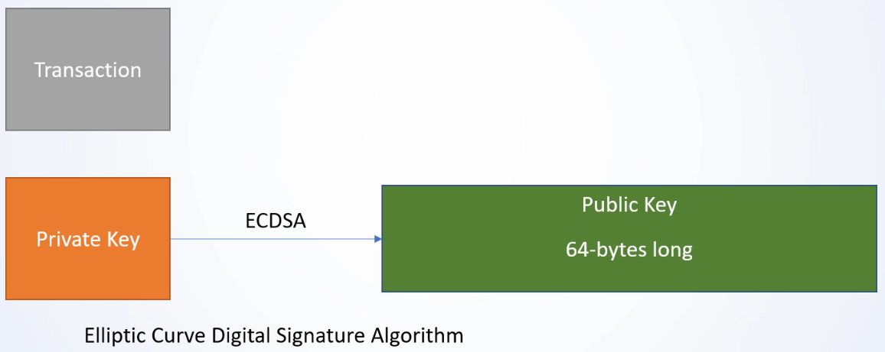

- _Step-4:_ From that public key, it creates the ethereum account
- Ethereum Account is nothing but keccak hash of the last 20 bytes of the public key

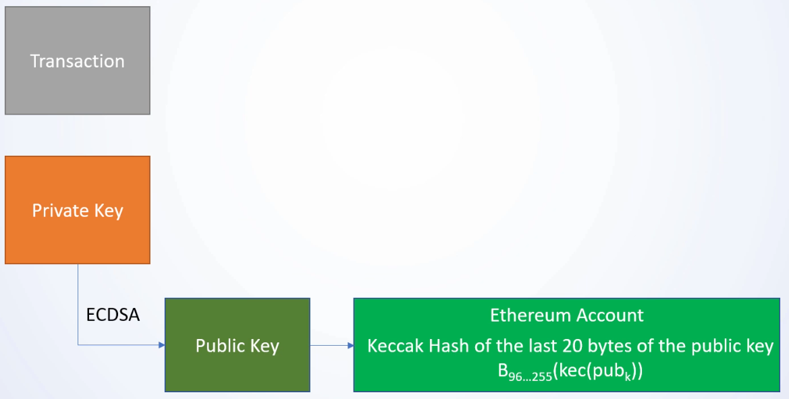

- _Step-5:_ By combining Transaction & Public Key, I can get the signed transaction
- It's r.s.v values

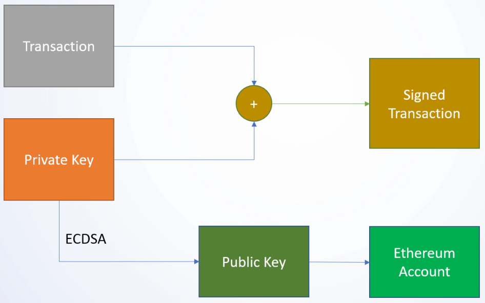

- _Step-6:_ Another function is ECRecover (Elliptic Curve Recover)
- It takes the transaction details that were provided
- It takes the r.s.v values from the transaction & re-create ethereum account

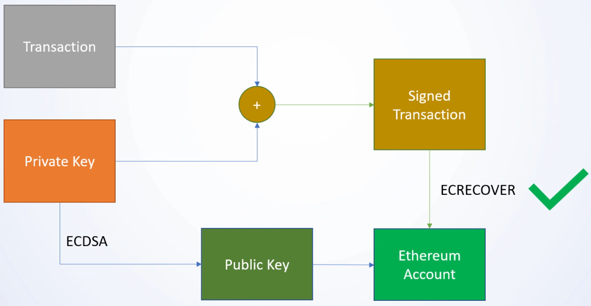

- Private key will keep it safe

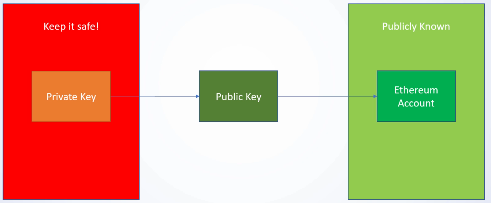

- _Step-7_ Under metamask, they use 12 word mnemonic
- Have multiple index to store the private key & public key
- So, I can shift many ethereum account what I want
- Seed phrase should me more private to recover the metamask account

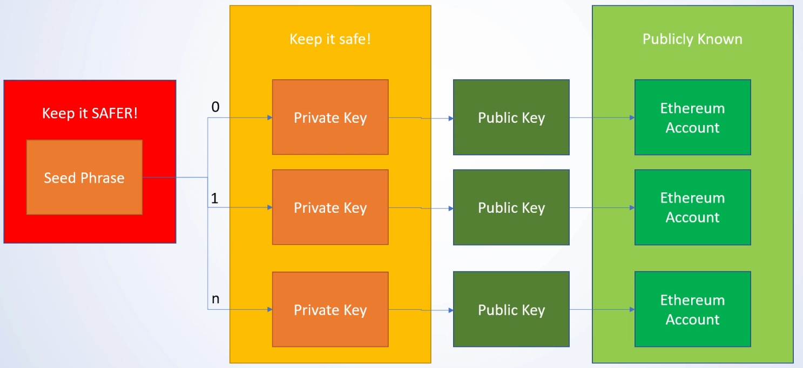

## Cryptographic Hashing

- The ideal cryptographic hash function has five main properties
  1. It's deterministic so the same message always results in the same hash
  2. It's quick to compute the hash value for any given message
  3. It is computationally infeasible to retrieve the original input from its hash value.
  4. A small change to a message should change the hash value so extensively that the new hash value appears uncorrelated with the old has value
  5. It's infeasible to find two different messages with the same hash value

## Cancel or Update Transaction

- Gas-Price Auction
  - The higher the gas price, the more likely it gets mined
- Send the same transaction nonce with higher gas free
  - Update: higher gas free
  - Cancel: Send no data + to = from
- If I send the difference transaction nonce, you add a new transaction to the transaction queue & it doesn't get mined unless the one with the lower nonce gets mined or canceled
- If I send the transaction to myself with the same nonce, then I can cancel it
- When I have other transaction pending with a higher nonce, then cancel it first

## Payable Modifier And `msg.value`

- To receive Eth, I need to add the `payable` modifier
- `payable` modifier tells solidity that the function is expecting eth to receive
- The msg-object contains information about the current message with the smart contract.
- It's a global variable that can be accessed in every function.

```js
//SPDX-License-Identifier: MIT

pragma solidity 0.8.15;

contract SampleContract {
  string public myString = "Hello World";

  function updateString(string memory _newString) public payable {
    if(msg.value == 1 ether) {
      myString = _newString;
    } else {
      payable(msg.sender).transfer(msg.value);
    }
  }
}
```

- See that every time you send 1 eth, you can update the string. But if you send less or more, you just get refunded.

## Fallback And Receive

- A

## Section Summary

- A

## The Smart Money Implementation

- A
