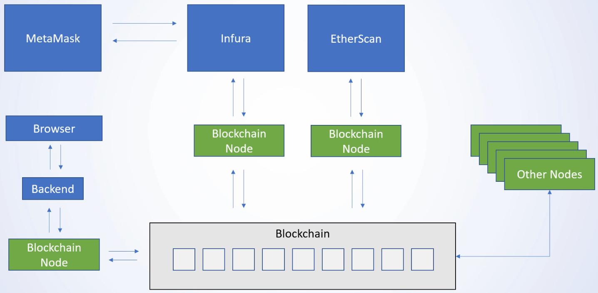
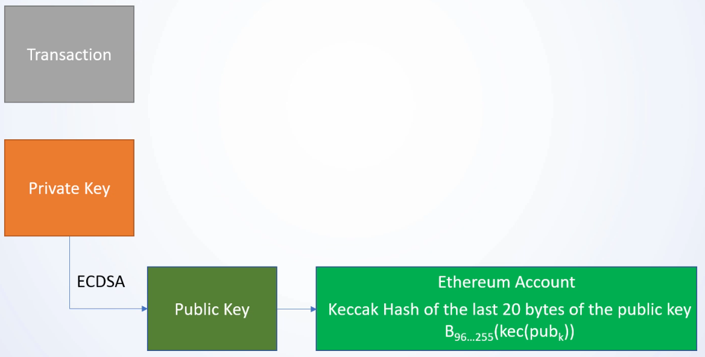
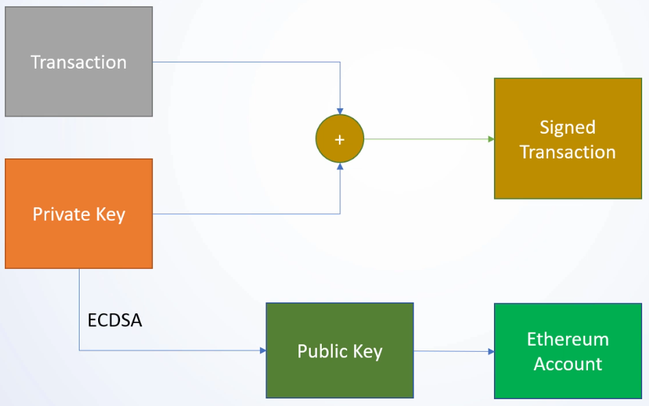
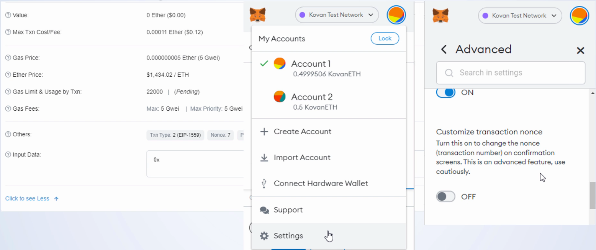

- [Smart Money - Deposit \& Withdrawals](#smart-money---deposit--withdrawals)
  - [Transaction Details](#transaction-details)
  - [Behind the Scenes of Metamask](#behind-the-scenes-of-metamask)
    - [Infura](#infura)
  - [MetaMask](#metamask)
  - [An Ethereum Transaction](#an-ethereum-transaction)
  - [Cryptographic Hashing](#cryptographic-hashing)
  - [Cancel or Update Transaction](#cancel-or-update-transaction)
  - [Payable Modifier And `msg.value`](#payable-modifier-and-msgvalue)
  - [Fallback And Receive](#fallback-and-receive)
  - [Section Summary](#section-summary)
  - [The Smart Money Implementation](#the-smart-money-implementation)

# Smart Money - Deposit & Withdrawals

## Transaction Details

- [Visit to see the transaction details](https://sepolia.etherscan.io/tx/0x5daec3d73538cd6cc42f7e683972d8afb6237d7971f74e6b75a10b4e7580ea91)


## Behind the Scenes of Metamask

### Infura

- Infura is a global infrastructure provider for decentralized applications (DApps).
- It allows developers to connect to the Ethereum network without running a full node
- Making it easier and faster to build DApps.

## MetaMask

- MetaMask is an easy way for developers to get started building DApps on the Ethereum blockchain.
- With MetaMask, you can
  - create and manage your own wallets,
  - send transactions, and
  - explore contracts.



## An Ethereum Transaction

- `gasPrice`
  - Base price of a gas
  - Priority to the miners
  - How fast the block will be mined


- _Q-1:_ How does the blockchain know that the transaction is not malicious?
- _Q-2:_ How does the Blockchain know it's allowed to transfer [value] from account [from] to account [to]?
- _Answer:_ Create a signature


- How that information comes from the blockchain?
- _Step-1:_ I send a transaction object


- _Step-2:_ I need a private key stored in the metamask


- _Step-3:_ Metamask uses `ECDSA` to create the public key


- _Step-4:_ From that public key, it creates the ethereum account
- Ethereum Account is nothing but `keccak` hash of the last `20` bytes of the public key



- _Step-5:_ By combining Transaction & Public Key, I can get the signed transaction
- It's r.s.v values



- _Step-6:_ Another function is `ECRecover` (Elliptic Curve Recover)
- It takes the transaction details that were provided
- It takes the r.s.v values from the transaction & re-create ethereum account


- Private key will keep it safe


- _Step-7_ Under metamask, they use 12 word mnemonic
- Have multiple index to store the private key & public key
- So, I can shift many ethereum account what I want
- Seed phrase should be more private to recover the metamask account


## Cryptographic Hashing

- The ideal cryptographic hash function has five main properties
  1. It's deterministic so the same message always results in the same hash
  2. It's quick to compute the hash value for any given message
  3. It is computationally infeasible to retrieve the original input from its hash value.
  4. A small change to a message should change the hash value so extensively that the new hash value appears uncorrelated with the old has value
  5. It's infeasible to find two different messages with the same hash value

## Cancel or Update Transaction

- Gas-Price Auction
  - The higher the gas price, the more likely it gets mined
- Send the same transaction nonce with higher gas free
  - Update: higher gas free
  - Cancel: Send no data + to = from
- If I send the difference transaction nonce, you add a new transaction to the transaction queue & it doesn't get mined unless the one with the lower nonce gets mined or canceled
- If I send the transaction to myself with the **same nonce**, then I can cancel it
- When I have other transaction pending with a higher nonce, then cancel it first
- Get the nonce of the pending transaction & enable custom nonce in the metamask



- Then send a transaction myself with the same nonce of pending transaction


- So, that transaction is mined earlier then previous pending transaction

## Payable Modifier And `msg.value`

- To receive Eth, I need to add the `payable` modifier in the function
- `payable` modifier tells solidity that the function is expecting eth to receive
- The `msg` object contains information about the current message with the smart contract.
- It's a global variable that can be accessed in every function.

```js
//SPDX-License-Identifier: MIT

pragma solidity 0.8.15;

contract SampleContract {
  string public myString = "Hello World";

  function updateString(string memory _newString) public payable {
    if(msg.value == 1 ether) {
      myString = _newString;
    } else {
      payable(msg.sender).transfer(msg.value); // Send back other value except 1 ether
    }
  }
}
```

- See that every time you send 1 eth, you can update the string. But if you send less or more, you just get refunded.
- _Note:_
  - Every address variable has `transfer()` function
  - Before sending the value, I have to wrap it using `payable`
  - `ether` is a global variable
- _Process:_
  - I can send the `ether` to the smart contract from my account
  - It can store that `ether` on it
  - If I send not equal to `1 ether`, then it will send the `ether`/`Gwei`/`wei` to me whatever I send before

## Fallback And Receive

- A value transfer without any kind of data then `receive` function will be called
- Otherwise, if there is a call-data, it will need a `fallback` function
- In `fallback`, `payable` is optional
  - If I want to call a function which is not present, then the `fallback` will be called
  - If I want that `fallback` function to also be able to receive any value, then need to add `payable` modifier

```js
//SPDX-License-Identifier: MIT

pragma solidity 0.8.15;

contract SampleFallback {
  uint public lastValueSent;
  string public lastFunctionCalled;

  receive() external payable {
    lastValueSent = msg.value;
    lastFunctionCalled = "receive";
  }

  fallback() external payable {
    lastValueSent = msg.value;
    lastFunctionCalled = "fallback";
  }
}
```

- If I have no `receive` function, then call-data with value or only value will be called `fallback`
- But `fallback` must be `payable`

## Section Summary

- Writing Txn
  - Need to send a transaction
  - Need to provide gas price
  - Need to mined by miner
- Reading Txn
  - From the local cache
  - But need to pay gas
  - Pay the gas for yourself
- `public`
  - Can be called internally & externally
- `private`
  - Only for the contract itself
  - Not externally reachable
  - & not via derived contracts
- `external`
  - Can be called from other contracts
  - Can be called externally
- `internal`
  - Only from the contract itself
  - & from the derived contracts
  - Can't be invoked by a transaction
- I can't completely avoid receiving ether
- Miner reward or self-destruct (address) will forcefully credit ether
- I can only rely on `2300` gas for `fallback` function
- `_contractAddress.transfer(1 ether)` - send only `2300` gas along
- Forcefully prevent contract execution if called with contract data - `require(msg.data.length == 0)`
- Global msg-object contains a value property (in `wei`)
- Address A -> Contract A -> Contract B
- ^`0.5 ETH`^^`0.3 Wei`
- Then in Contract A, `msg.value` will be `0.5 ETH`
- In Contract B, `msg.value` will be `0.3 Wei`

## The Smart Money Implementation

- Implemention will be found in `SendWithdrawMoney.sol` file
