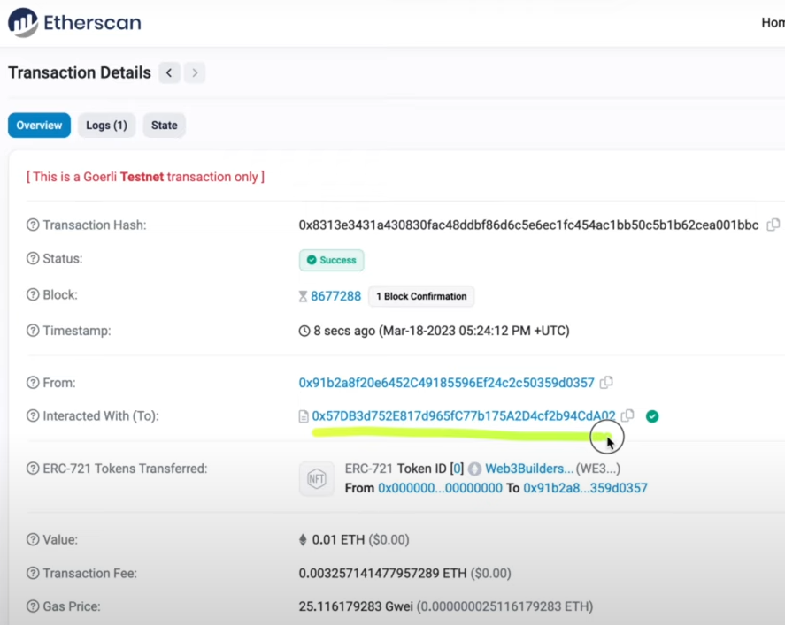
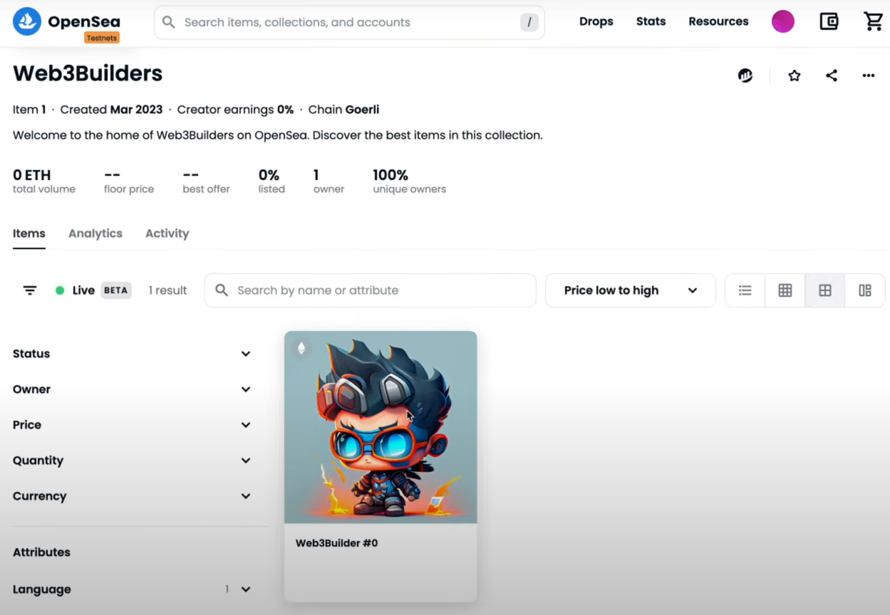
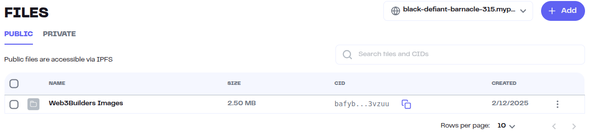

- [Learning Solidity from YT as An Expert](#learning-solidity-from-yt-as-an-expert)
  - [Build ERC-721 Contract](#build-erc-721-contract)
  - [Create NFT With AI](#create-nft-with-ai)
  - [Create \& Upload NFT Metadata](#create--upload-nft-metadata)
    - [Create Metadata For NFT Images](#create-metadata-for-nft-images)
    - [Upload Metadata in IPFS](#upload-metadata-in-ipfs)
  - [Build ERC-1155 Contract](#build-erc-1155-contract)

# Learning Solidity from YT as An Expert

## Build ERC-721 Contract

- Todo list:
  - Add public mint function
  - Add payment requirement
  - Add supply limit
  - Add allowlist mint
  - Clean up code
  - Add withdraw function
- First visit [OpenZeppelin Smart Contract Wizard](https://wizard.openzeppelin.com/)
- It's an interactive smart contract generator based on OpenZeppelin Contracts.
- Select `ERC721` tab
- Enable some features like:
  - `Mintable` - Privileged account will be able to emit new tokens
  - `Auto Increment Ids` - New tokens will be automatically an incremental id
  - `Burnable` - Token holders will be able to destroy their tokens
  - `Pausable` - Allow to pause the contract/mint
  - `Enumerable` - Allows to keep track of how many ntfs have minted so far
  - `URI Storage` - Allows updating token URIs for individual token IDs.
- I can see the smart contract in `Contracts/Web3BuildersERC721.sol` file
- After deployment, I can view the smart contract in the test **OpenSea** website. [see more](https://testnets.opensea.io/)
- Need to login using **Metamask**
- Copy the contract address from Etherscan



- Search in Test OpenSea using that contract address



- I am the owner of that NFT
- So, I can edit the NFT collection

## Create NFT With AI

- Visit [Midjourney](https://www.midjourney.com/)
- Sign up using discord
- Enter some mentioned channels & give the command to using `/imagine [command]`
- For more information, need to visit [Midjouney Docs](https://docs.midjourney.com/docs/quick-start)

## Create & Upload NFT Metadata

- _IPFS:_
  - It's a decentralize storage
  - Split the file into many different parts (CID)
  - And save those in many different directions
  - That file has one main CID which is the combination of these CIDs
- If I upload same image or file again, then ipfs generates same CIDs
- So no duplicate file or image

### Create Metadata For NFT Images

- [NFT Metadata Template](https://github.com/NazaWEb/nft-metadata-template)
- See `NFT-Metadata-Template` folder
- Create a folder & upload those png files in [Pinata](https://pinata.cloud/)



- Now, copy the CID (Content Identifier) link to use in `image` field in metadata
- I can find some information about the [Metadata Standards](https://docs.opensea.io/docs/metadata-standards#metadata-structure)
- I can create my metadata accordingly

```json
{
  "name": "Web3Builders #0",
  "description": "",
  "image": "ipfs://bafybeid5ccojexiopndsyos4rl3vzuu/0.png", // CID
  "attributes": [
    {
      "trait_type": "Language",
      "value": "JavaScript"
    },
    {
      "trait_type": "OS",
      "value": "Mac"
    },
    {
      "trait_type": "Speed",
      "value": "Super Fast"
    }
  ]
}
```

### Upload Metadata in IPFS

- Complete all the json files with related metadata
- Now upload by creating another folder with that json folder in the Pinata

## Build ERC-1155 Contract

- Todo list:
  - Add public mint function
  - Add allowlist mint
  - Add supply limit
  - Add payment requirement
  - Add withdraw function
  - Create payment splitter
- _ERC-721:_ One owner per NFT
- _ERC-1155:_ Multiple owners per NFT
- Taking bootstrap starter for ERC-1155 from [OpenZeppelin Smart Contract Wizard](https://wizard.openzeppelin.com/)
- Select `ERC1155` tab
- Enable some features like:
  - `Mintable` - Privileged account will be able to emit new tokens
  - `Burnable` - Token holders will be able to destroy their tokens
  - `Supply Tracking`
    - Keeps track of total supply of tokens
    - How many NFTs I've minted so far
  - `Pausable` - Allow to pause the contract/mint
  - `Updatable URI` - Able to set a new URI for all token types.
-
