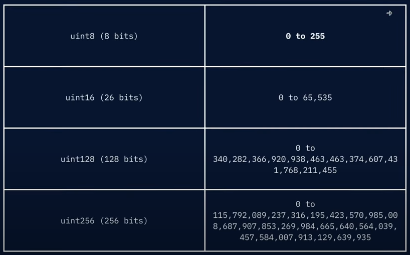
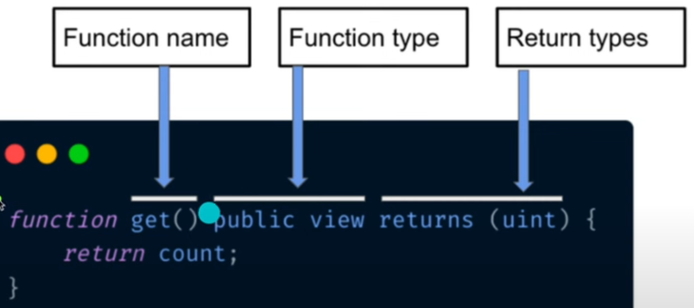
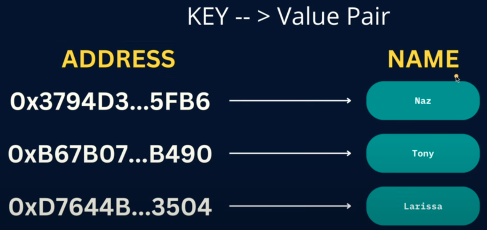
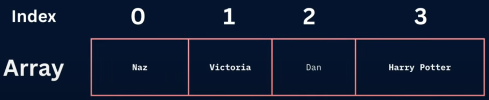
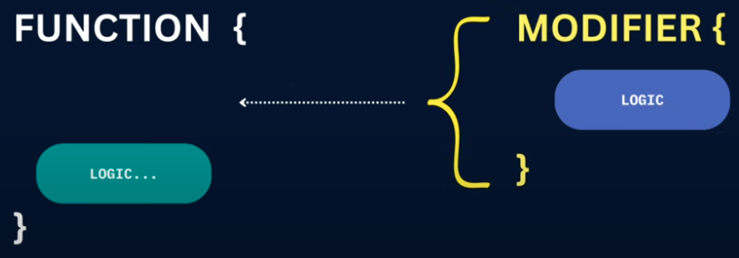
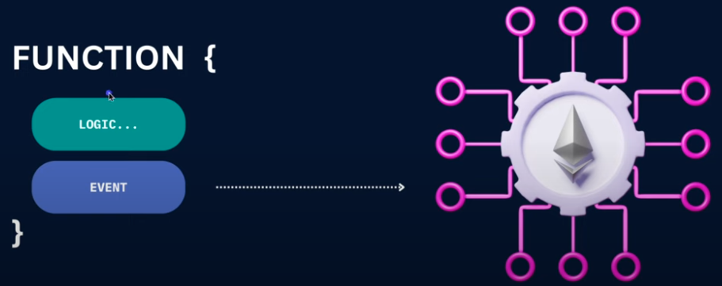
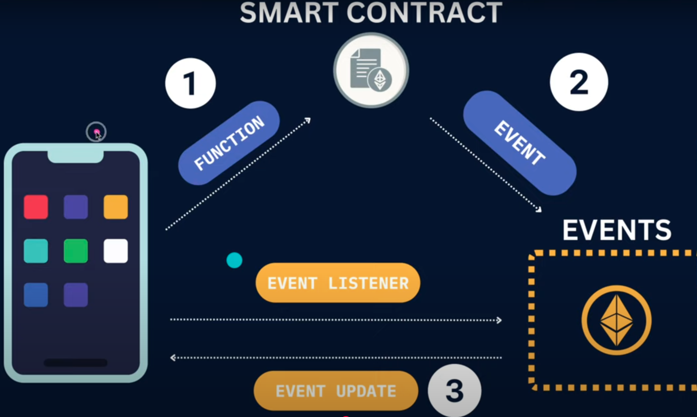
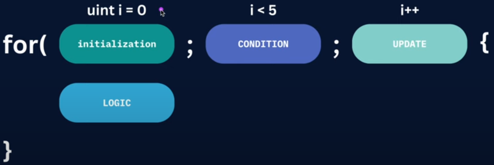
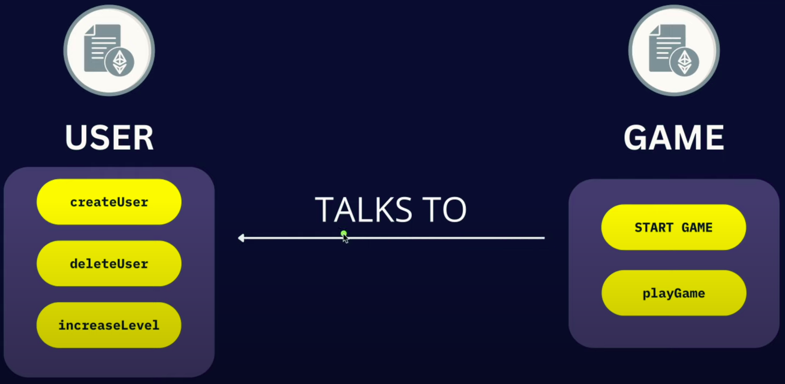
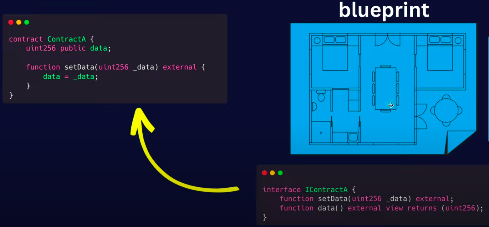

- [Learning Solidity from YT](#learning-solidity-from-yt)
  - [Variables](#variables)
    - [`uint` ranges:](#uint-ranges)
    - [Function:](#function)
    - [Mapping:](#mapping)
    - [Array:](#array)
    - [`structs`](#structs)
    - [`require()`](#require)
    - [`modifier`](#modifier)
  - [Events](#events)
  - [Loop](#loop)
  - [Inheritance](#inheritance)
  - [Inherit Ownable from OpenZeppelin](#inherit-ownable-from-openzeppelin)
  - [Contract to Contract Interaction](#contract-to-contract-interaction)

# Learning Solidity from YT

- [YT Video Link](https://www.youtube.com/watch?v=AYpftDFiIgk)
- [Github Repo](https://github.com/NazaWEb/ultimate-solidity-course-for-complete-beginners)

## Variables

### `uint` ranges:



### Function:



- If I **modify** the state variable then use nothing

```js
contract Calculator {
  uint256 result = 0;

  function add(uint256 num) public {
    result += num;
  }
}
```

- If I **don't modify** the declared contract variable but only use that variable then use `view`

```js
contract Calculator {
  uint256 result = 0;

  function add(uint256 num) public view {
    return result;
  }
}
```

- If neither read nor modify state, use `pure`

```js
function countUp(uint limit) public pure returns(uint) {
  uint sum = 0;
  for (uint i = 1; i <= limit; i++) {
    sum += i;
  }

  return sum;
}
```

### Mapping:



```js
contract Mapping {
  // Mapping from address to uint
  mapping(address => uint) public myMap;

  function get(address _addr) public view returns (uint) {
    // Mapping always returns a value.
    // If the value was never set, it will return the default value
    return myMap[_addr];
  }

  function set(address _addr, uint _i) public {
    // Update the value at this address
    myMap[_addr] = _i;
  }

  function remove(address _addr) public {
    // Reset the value to the default value.
    delete myMap[_addr];
  }
}
```

### Array:



```js
contract Array {
  // Several ways to initialize an array
  uint[] public arr;
  uint[] public arr2 = [1, 2, 3]; // Length: 3

  // Fixed sized array, all elements initialized to 0
  uint[10] public myFixedSizedArr; // Index: 0-9
  string[5] public name; // Index: 0-4

  function get(uint _i) public view returns(uint) {
    return arr[_i];
  }

  function add(uint value) public {
    // Add a new element to the end of the array
    arr.push(value);
  }

  function getArrLength() public view returns(uint) {
    // Return the length of the array
    return arr.length;
  }
}
```

### `structs`


- Define a `structs`

```js
contract TeslaRegistry {
  struct Tesla {
    string model; // Key
    uint256 year;
    string color;
    uint256 mileage;
    string vin;
  }

  // Structure array
  Tesla[] public teslas;
}
```

- Add data on it
- `memory` means EVM stores the `string` value in a temporary memory
- After finishing to transfer it, EVM destroy it from the temporary momory

```js
contract TeslaRegistry {
  // ...continue

  function addTesla(string memory model, uint256 year, string color, uint256 mileage, string memory vin) {
    // Prepare the structure data
    Tesla memory newTesla = Tesla({
      model: model,
      year: year,
      color: color,
      mileage: mileage,
      vin: vin
    })

    // Add the structure data
    teslas.push(newTesla);
  }
}
```

### `require()`

- Make sure the condition is `true`
- If the given condition is `false`, then throw the error I mentioned & revert the transaction

```js
contract SimpleToken {
  uint256 public maxPerMint = 3;

  function mint(uint256 amount) public {
    require(amount <= maxPerMint, "No more then 3 allowed");

    // ...continue
    _mint(amount);
  }
}
```

### `modifier`

- Add behavior to a function
- _Like:_ If I want to use this function then I need to admin or owner
- To check, caller of that contract is the owner using `modifier`



- `constructor` will be only called while deployment of the contract
- Make sure only the `owner` can call `changeOwner` function

```js
contract Test {
  address public owner;

  constructor() {
    owner = msg.sender;
  }

  // Create the modifier
  modifier onlyOwner() {
    require(msg.sender == owner, 'You are not the owner');
    _;
  }

  // Use the modifier to call the function
  function changeOwner(address newOwner) public onlyOwner {
    owner = newOwner;
  }
}
```

## Events

- Notification for the blockchain



- DApp call the function
- Smart contract emit an events
- DApp listens that event & get updated about the event



- `indexed` means cached the indexed data

```js
contract EventExample {
  event EventName(uint256 indexed data1, string data2);

  function someFunc() public {
    // ...continue
    emit EventName(data1, data2);
  }
}
```

- `abi.json` is like instruction manual of the smart contract
- It's a instruction of how to use my smart contract
- ABI stands for **Application Binary Interface**
- Solidity DApp (Later)

## Loop

- Create repetitive tasks



```js
function countUp(uint limit) public pure returns(uint) {
  uint sum = 0;
  for (uint i = 1; i <= limit; i++) {
    sum += i;
  }

  return sum;
}
```

## Inheritance

- Take the behavior or functionality from the other contract or class


- Use the `is` keyword to inherit

```js
// Parent contract
contract Parent {
  uint256 public parentData;

  // ...continue
}

// Child contract inheriting from Parent
contract Child is Parent {
  uint256 public childData;

  // Make a connection between two smart contract
  constructor(uint256 _childData) {
    childData = _childData;
  }
}
```

- Use `virtual` keyword
- So, child contract must `override` that functionality
- Use `super` to call the parent method
- See `MultiplayerGameInheritance.sol`

## Inherit Ownable from OpenZeppelin

- Why use `OpenZeppelin`?
  - Standard for smart contract industry
  - Have some extra functionalities
- Including `OpenZeppelin`:

```js
// Import
import "@openzeppelin/contracts/access/Ownable.sol";

// Inheritance
contract Twitter is Ownable {
  // TBC

  // Remove my own `onlyOwner` modifier

  // Use `onlyOwner` from `OpenZeppelin`
  function changeTweetLength(uint16 newTweetLength) public onlyOwner {
    MAX_TWEET_LENGTH = newTweetLength;
  }
}
```

- After compilation, I can found out some extra functionality in Remix workspace which comes from `OpenZeppelin`

## Contract to Contract Interaction

- Contract interaction



- Interface is like a blue print of any contract



- So any other contract, use the `IContractA` in the `constructor` function to communicate with `ContractA`
- See the `Interface/Game.sol` & `Interface/User.sol` files
- And must see the final output of TweeterDApp in `TweeterDApp/Tweeter.sol` & `TweeterDApp/User.sol` files
